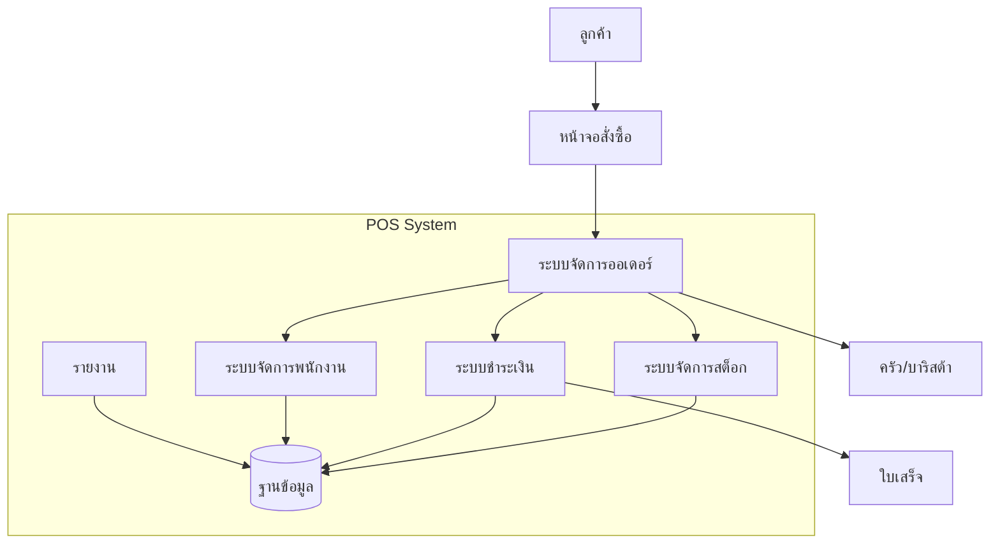
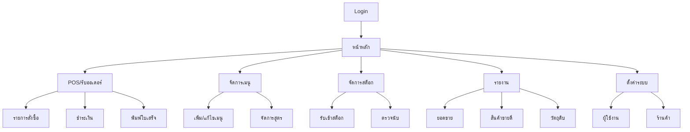

# ระบบ POS ร้านกาแฟ

## โครงสร้างระบบ


## หน้าจอระบบ


1. หน้าหลัก (Dashboard)
   - แสดงภาพรวมยอดขายวันนี้
   - แสดงออเดอร์ที่กำลังทำ
   - แจ้งเตือนวัตถุดิบใกล้หมด
   - เมนูเข้าถึงฟังก์ชันต่างๆ

2. POS/รับออเดอร์
   - รายการสั่งซื้อ: บันทึกรายการสินค้าที่ลูกค้าสั่ง ปรับแต่งตามความต้องการ
   - ชำระเงิน: รับชำระผ่านเงินสด บัตร หรือ QR
   - พิมพ์ใบเสร็จ: ออกใบเสร็จให้ลูกค้า

3. จัดการเมนู
   - เพิ่ม/แก้ไขเมนู: สร้างเมนูใหม่ ปรับราคา รูปภาพ และรายละเอียด
   - จัดการสูตร: กำหนดวัตถุดิบและปริมาณที่ใช้ในแต่ละเมนู

4. จัดการสต็อก
   - รับเข้าสต็อก: บันทึกการซื้อวัตถุดิบเข้าร้าน
   - ตรวจนับ: นับและปรับปรุงจำนวนวัตถุดิบคงเหลือ

5. รายงาน
   - ยอดขาย: รายงานยอดขายตามช่วงเวลา
   - สินค้าขายดี: วิเคราะห์เมนูที่ขายดี
   - วัตถุดิบ: ติดตามการใช้วัตถุดิบ

6. ตั้งค่าระบบ
   - ผู้ใช้งาน: จัดการบัญชีพนักงาน กำหนดสิทธิ์การใช้งาน
   - ร้านค้า: ตั้งค่าข้อมูลร้าน ที่อยู่ เบอร์โทร


## โครงสร้างฐานข้อมูล
```mermaid
erDiagram

    
    CATEGORY {
        int category_id PK
        string name
        string description
        boolean status
    }
    CATEGORY ||--|{ MENU : "in"
    MENU ||--o{ RECIPE : has
    MENU {
        int menu_id PK
        string name
        decimal price
        string category
        boolean status
    }

    RECIPE ||--o{ INVENTORY : uses
    RECIPE {
        int recipe_id PK
        int menu_id FK
        int inventory_id FK
        decimal quantity_needed
        string unit
    }

    INVENTORY {
        int inventory_id PK
        string item_name
        decimal quantity
        int volume_per_unit
        string unit
        decimal cost
        int min_stock
    }

    MENU ||--o{ ORDER_ITEM : contains
    ORDER ||--o{ ORDER_ITEM : has
    ORDER {
        int order_id PK
        datetime order_date
        string status
        decimal total_amount
        int cashier_id FK
    }
    
    ORDER_ITEM {
        int order_item_id PK
        int order_id FK
        int menu_id FK
        int quantity
        decimal unit_price
        text notes
    }
    
    PAYMENT ||--|| ORDER : for
    PAYMENT {
        int payment_id PK
        int order_id FK
        datetime payment_date
        decimal amount
        string payment_method
    }
    
    EMPLOYEE ||--o{ ORDER : processes
    EMPLOYEE {
        int employee_id PK
        string name
        string role
        string username
        string password_hash
    }